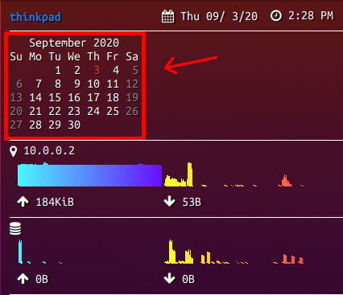

# conky-calendar

Prints a simple calendar with conky format strings embedded.

Initially created as an exersise in Rust, this project was inspired by @zeromancer's version linked [here](https://github.com/zeromancer/conky-calendar).

This version improves upon the existing program because it only needs to run one time to produce the calendar output, as opposed to four times with different flags. It embeds the conky format strings in the program's output in order to enable this.

## Usage
Running `conky-calendar` without any arguments will produce the same output as `cal`.
```
❯ conky-calendar

   September 2020   
Su Mo Tu We Th Fr Sa
       1  2  3  4  5 
 6  7  8  9 10 11 12 
13 14 15 16 17 18 19 
20 21 22 23 24 25 26 
27 28 29 30 
```

`-h` or `--help` will print the help message, which specifies the various arguments that can be used.
```
conky-calendar 1.0
by Michael Noguera
Prints a simple calendar with conky format strings embedded.

USAGE:
    conky-calendar [OPTIONS]

FLAGS:
    -h, --help       Prints help information
    -V, --version    Prints version information

OPTIONS:
    -d, --day-color <COLOR>        Hex color to use for otherwise-uncolored days. Omit the '#' sign.
    -l, --label-color <COLOR>      Hex color to use for the month name and weekday labels. Omit the '#' sign.
    -t, --today-color <COLOR>      Hex color to use for the current day. Omit the '#' sign.
    -w, --weekend-color <COLOR>    Hex color to use for weekends. Omit the '#' sign.
```

## Example
To produce the output pictured above, I use the following command:
```
❯ conky-calendar --today-color dd3a21 --weekend-color 888
   September 2020   
Su Mo Tu We Th Fr Sa
       1  2 ${color #dd3a21} 3 ${color} 4 ${color #888} 5 ${color}
${color #888} 6 ${color} 7  8  9 10 11 ${color #888}12 ${color}
${color #888}13 ${color}14 15 16 17 18 ${color #888}19 ${color}
${color #888}20 ${color}21 22 23 24 25 ${color #888}26 ${color}
${color #888}27 ${color}28 29 30 
```
Thus I put this in my `conky.config` file:
```
${execpi 600 conky-calendar --today-color dd3a21 --weekend-color 888}
```